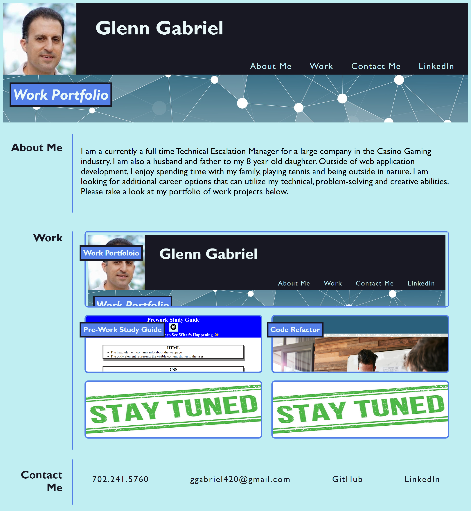

# gabriel-portfolio
Glenn Gabriel Portfolio Web Application

## Description

The purpose of this web application is to provide a means to showcase my skills to potential employer by providing easy access to sample work.  It also provides an opportunity to learn more about me and contact me via multiple channels.

The application itself also serves as an example of my skills.  The development of the application provided an opportunity for me to practice many HTML and CSS skills that I have learned recently.

## Usage

A user can scroll up and down the web page to view various materials.  The top navigation bar provides quick access to the different sections.  The bottom navigation bar provides easy contact to my via links to call, email or lead to other sites associated with the developer.  Clicking on the work cards will open the portfolio applications in a new web browser tab.

## Credits

List your collaborators, if any, with links to their GitHub profiles.

If you used any third-party assets that require attribution, list the creators with links to their primary web presence in this section.

If you followed tutorials, include links to those here as well.

## Features

If your project has a lot of features, list them here.
